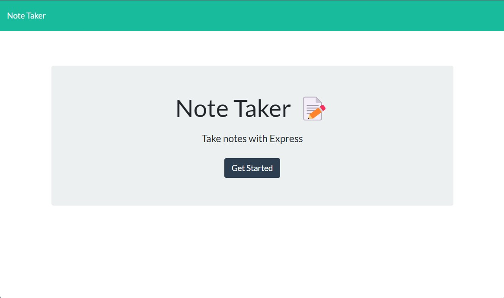
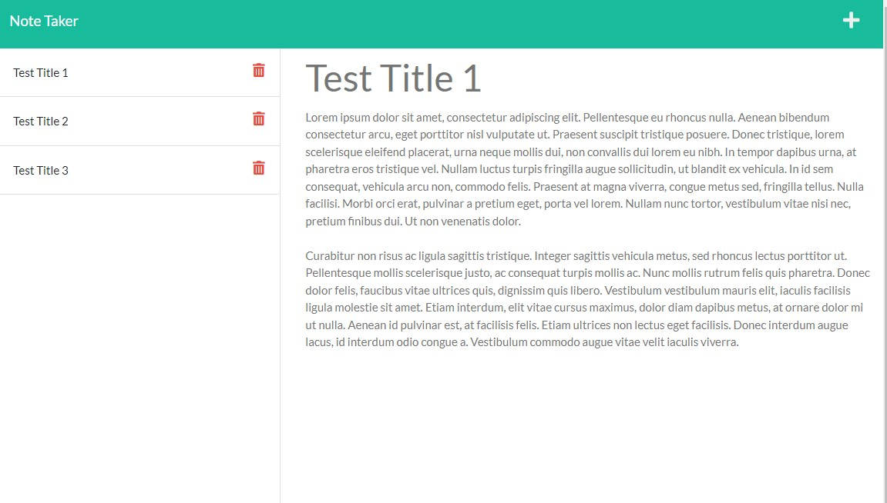

# Note Taker
# Solution for Module 11 Challenge

This page has been created as a tool for taking and recalling notes, as well as presenting the ability to delete the created notes as well.  

  

[Link to Live Site](https://dry-stream-30935.herokuapp.com/)  
[Link to GitHub Repo](https://github.com/fryylord/notetakerEXPRESS)  

- [Installation](#installation)
- [Usage](#usage)
- [Credits](#credits)
- [License](#license)

## Installation

There is no installation necessary to use the existing server, the program is functional after selecting "Get Started" on the landing page.

It can be run locally, if the user clones the repository from github to the local machine.
After navigating to the clone repository in the command line, run npm install to install all dependencies. To use the application locally, run node server.js in your CLI, and then open http://localhost:3001 in your preferred browser.

## Usage

After selecting "Get Started" from the landing page, the user is taken to the note taker itself.  Upon arrival the user is presented existing saved notes (if there are any) and an option for creating a new note to the right of this list.  

Upon inputing data both into the title and text for the note, a save icon appears next to the + in the upper right hand corner.  Pressing the save icon causes the inote to be created in the archived notes list.

When the user clicks an item on the list, that cards content is displayed to the right.  If the user desires to create a new card, the + icon can be selected clearing the display and allowing for a new card to be created.

Any previous notes can be deleted by selecting the trash can on the right side of their list item.  

## Credits

https://ku.bootcampcontent.com/ku-coding-boot-camp/KU-VIRT-FSF-PT-09-2022-U-LOLC/  
https://github.com/amandalatkins/note-taker/
https://github.com/gidmp/Note-Taker-With-Express/
https://github.com/kara-krzystan/note-taker/

## License
 
MIT License

Copyright (c) 2022 fryylord

Permission is hereby granted, free of charge, to any person obtaining a copy
of this software and associated documentation files (the "Software"), to deal
in the Software without restriction, including without limitation the rights
to use, copy, modify, merge, publish, distribute, sublicense, and/or sell
copies of the Software, and to permit persons to whom the Software is
furnished to do so, subject to the following conditions:

The above copyright notice and this permission notice shall be included in all
copies or substantial portions of the Software.

THE SOFTWARE IS PROVIDED "AS IS", WITHOUT WARRANTY OF ANY KIND, EXPRESS OR
IMPLIED, INCLUDING BUT NOT LIMITED TO THE WARRANTIES OF MERCHANTABILITY,
FITNESS FOR A PARTICULAR PURPOSE AND NONINFRINGEMENT. IN NO EVENT SHALL THE
AUTHORS OR COPYRIGHT HOLDERS BE LIABLE FOR ANY CLAIM, DAMAGES OR OTHER
LIABILITY, WHETHER IN AN ACTION OF CONTRACT, TORT OR OTHERWISE, ARISING FROM,
OUT OF OR IN CONNECTION WITH THE SOFTWARE OR THE USE OR OTHER DEALINGS IN THE
SOFTWARE.

## Features

Multiple notes stored  
Deletable notes  
Recallable notes  

## Tests

None
